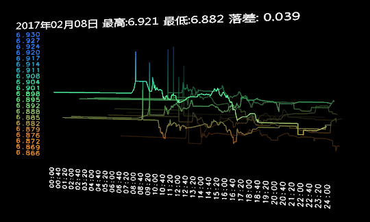
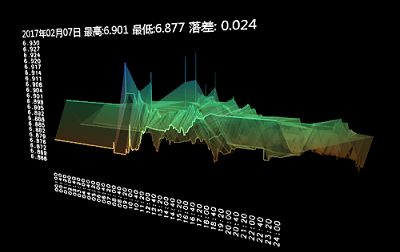

### 获取外汇牌价历史记录  

* ### Branch Visualization  
  基于 tag threads1.0  

* 目录结构  
  /Data 获取汇率数据，相关脚本  
  /Visualization 可视化程序  

* display_control.pl  
  从 ../Data 目录获取数据，线条图  

    

* display_triangulation.pl  
  从 ../Data 目录获取数据，立体图  

    

* display_nearly.pl  
  展示最近N天的汇率曲线图，在线获取数据。  
  日期设置：`our $from = DateTime->today()->add( days => -5 );`  

* BUG  
  2007年8月15日出现最小值为0.076的情况，原因：  
  ```perl
  '2007.08.15' => {
    '16:29:01' => ['7.57','7.51','7.6',undef,'759.21','759.21'],
  }
  ```
